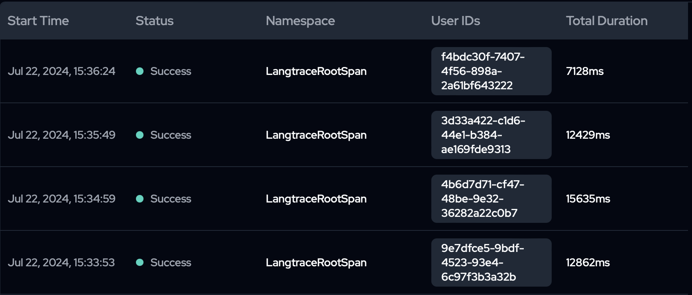
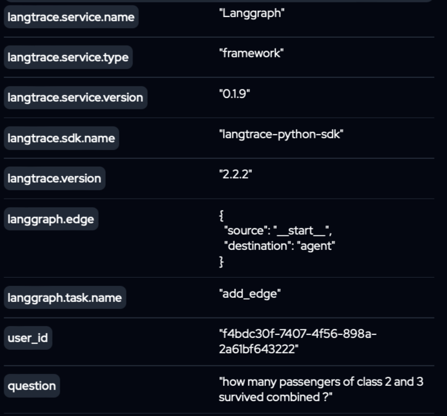
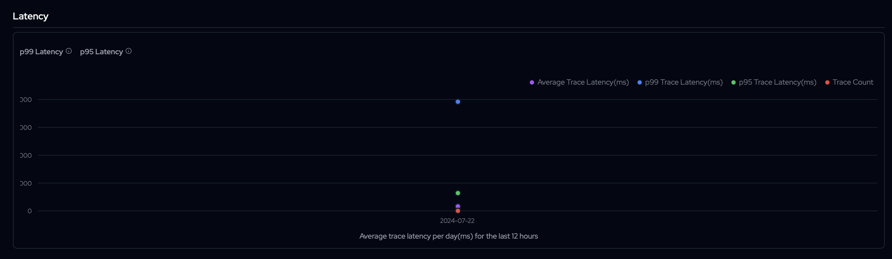

# Mini Data Analyst using LLM Agent

This project demonstrates the setup of a data analyst which has the ability to answer user questions based on the data available. The data is stored as csv files in the `data` directory. It also implementes observability using langtrace.

Demo Link (Youtube): [Mini Data Analyst](https://youtu.be/iYk8qfpZFLE)

# Components
1. Langgraph is used to structure the flow of execution
2. The setup involves an agent alongwith a tool `execute` which is used to execute python code generated by the agent
3. The model being used on local is llama3 8B while on aws bedrock it is llama3 70B
4. The setup allows to use locally hosted model or to use aws bedrock
5. Langtrace is used for observability, user_id is used as a session_id to distinguish each run while a custom attribute is set to log the question asked by the user


## Langtrace
### Traces

### Trace Overview

### Attributes

### Latency


# Setup

1. Create a virtual environment
2. Install `pip-tools` using `pip install pip-tools`
3. `requirements.in` file contains the list of packages to be installed
4. Run `pip-compile` to generate the `requirements.txt` file
5. Run `pip install -r requirements.txt` to install the packages

# Usage
1. Open `app.py` which is the entry point of the application
2. If you want to use locally hosted model
    - Set `LOCAL` to `True`
    - Make sure the model is running on `http://localhost:11434` (if using `ollama` run `ollama pull llama3` to download the model one time followed by `ollama serve`)
3. If you want to use aws bedrock
    - Make sure you setup aws bedrock and have got model access approved
    - Setup your aws credentials using `aws configure`
    - Set `LOCAL` to `False`
4. The following can be configured while initializing `Runner`:
    - `take_human_consent: bool` - If set to `True`, the agent will ask for user consent before executing the code and calling model
    - `debug_conversation: bool` - If set to `True`, the entire conversation will be printed at the end
    - `debug_final_state: bool` - If set to `True`, the final state will be printed at the end
5. To use langtrace, you can
    - Setup langtrace via docker 
    - Or use their cloud service with the api key in `env.ini`
    ```env.ini
    [DEFAULT]
    LANGTRACE_API_KEY = <api_key>
    ```
5. Run `python app.py` to start the application